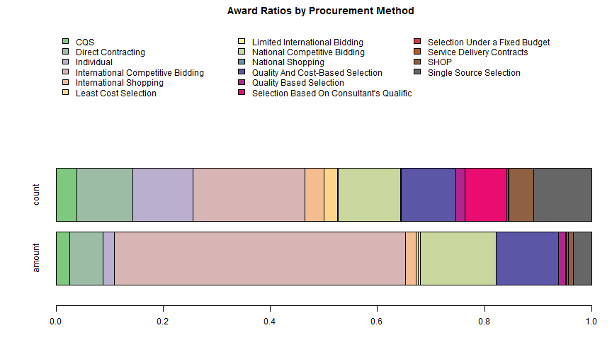

## Demos of Data Analytics & Metrics

Sample visualizations with World Bank Procurement data from 1995 to 2014.


---

## Top 10 suppliers by contracts

[1] "By Contracts"


|  &nbsp;   |           supplier           |  count  |
|:---------:|:----------------------------:|:-------:|
|  **28**   |   ANGELIQUE INTERNATIONAL    |   18    |
|  **442**  |       MCS ELECTRONICS        |   16    |
|   **3**   | A/S VENTART, TALINN, ESTONIA |   12    |
|  **34**   |         AO BITOTECH          |   12    |
|  **133**  |  CENTER FOR POLICY RESEARCH  |   12    |
|  **156**  |       CLYDE E. GOULDEN       |   12    |
|  **115**  |    BSB SERVICE CO., LTD.     |   10    |
|  **175**  |      DALAIVAN AUDIT LLC      |    9    |
|  **227**  |          ERDENE ZAM          |    9    |
|  **344**  |      ITOCHU CORPORATION      |    9    |


---

## Sector distribution of contract awards

```r
pander(aggregate(count ~ major_sector, data = wbdat, sum), style = "rmarkdown", 
    split.cells = Inf)
```


|     major_sector     |  count  |
|:--------------------:|:-------:|
|    (H)Environment    |    1    |
|     Agriculture      |   114   |
|      Education       |   93    |
|   Energy & mining    |   183   |
|       Finance        |   103   |
| Health & social serv |   46    |
|  Industry and trade  |   71    |
| Info & communication |   27    |
|  Public admin, Law   |   511   |
|    Transportation    |   83    |
| Water/sanit/fld prot |   185   |


---

## Distribution of contract awards by procurement category


```r
pander(aggregate(count ~ proc_categ, data = wbdat, sum), style = "rmarkdown", 
    split.cells = Inf)
```


|     proc_categ      |  count  |
|:-------------------:|:-------:|
|     Civil Works     |   204   |
| Consultant Services |   690   |
|        Goods        |   504   |
|         NC          |   19    |


---
## Award Ratios by Procurement Method
 


---

## Award Ratios by Supplier Country

 


---

## Distribution of Spending

<iframe src='
figure/unnamed-chunk-7.html
' scrolling='no' seamless class='rChart 
nvd3
 '
id=iframe-
chart18644ea045f8
></iframe>
<style>iframe.rChart{ width: 100%; height: 400px;}</style>


---

## Time Series by Procurement Category

<iframe src='
figure/unnamed-chunk-8.html
' scrolling='no' seamless class='rChart 
highcharts
 '
id=iframe-
chart1864ca231a8
></iframe>
<style>iframe.rChart{ width: 100%; height: 400px;}</style>


## Demos of Data Analytics & Metrics

Sample visualizations with World Bank Procurement data from 1995 to 2014.


```
## Warning: cannot open file './data/wb_data.csv': No such file or directory
```

```
## Error: cannot open the connection
```


---

## Top 10 suppliers by contracts

[1] "By Contracts"


|  &nbsp;   |           supplier           |  count  |
|:---------:|:----------------------------:|:-------:|
|  **28**   |   ANGELIQUE INTERNATIONAL    |   18    |
|  **442**  |       MCS ELECTRONICS        |   16    |
|   **3**   | A/S VENTART, TALINN, ESTONIA |   12    |
|  **34**   |         AO BITOTECH          |   12    |
|  **133**  |  CENTER FOR POLICY RESEARCH  |   12    |
|  **156**  |       CLYDE E. GOULDEN       |   12    |
|  **115**  |    BSB SERVICE CO., LTD.     |   10    |
|  **175**  |      DALAIVAN AUDIT LLC      |    9    |
|  **227**  |          ERDENE ZAM          |    9    |
|  **344**  |      ITOCHU CORPORATION      |    9    |


---

## Sector distribution of contract awards

```r
pander(aggregate(count ~ major_sector, data = wbdat, sum), style = "rmarkdown", 
    split.cells = Inf)
```


|     major_sector     |  count  |
|:--------------------:|:-------:|
|    (H)Environment    |    1    |
|     Agriculture      |   114   |
|      Education       |   93    |
|   Energy & mining    |   183   |
|       Finance        |   103   |
| Health & social serv |   46    |
|  Industry and trade  |   71    |
| Info & communication |   27    |
|  Public admin, Law   |   511   |
|    Transportation    |   83    |
| Water/sanit/fld prot |   185   |


---

## Distribution of contract awards by procurement category


```r
pander(aggregate(count ~ proc_categ, data = wbdat, sum), style = "rmarkdown", 
    split.cells = Inf)
```


|     proc_categ      |  count  |
|:-------------------:|:-------:|
|     Civil Works     |   204   |
| Consultant Services |   690   |
|        Goods        |   504   |
|         NC          |   19    |


---
## Award Ratios by Procurement Method
 


---

## Award Ratios by Supplier Country

 


---

## Detailed look at country/sector

<iframe src='
figure/unnamed-chunk-15.html
' scrolling='no' seamless class='rChart 
nvd3
 '
id=iframe-
chart186453a5e50
></iframe>
<style>iframe.rChart{ width: 100%; height: 400px;}</style>

---

## Distribution of Spending

<iframe src='
figure/unnamed-chunk-16.html
' scrolling='no' seamless class='rChart 
nvd3
 '
id=iframe-
chart18645ba937
></iframe>
<style>iframe.rChart{ width: 100%; height: 400px;}</style>


---


## Time Series (Top 5 Sectors)

<iframe src='
figure/unnamed-chunk-17.html
' scrolling='no' seamless class='rChart 
highcharts
 '
id=iframe-
chart18642cc13106
></iframe>
<style>iframe.rChart{ width: 100%; height: 400px;}</style>


---

## Time Series by Procurement Category

<iframe src='
figure/unnamed-chunk-18.html
' scrolling='no' seamless class='rChart 
highcharts
 '
id=iframe-
chart186417946f6a
></iframe>
<style>iframe.rChart{ width: 100%; height: 400px;}</style>

